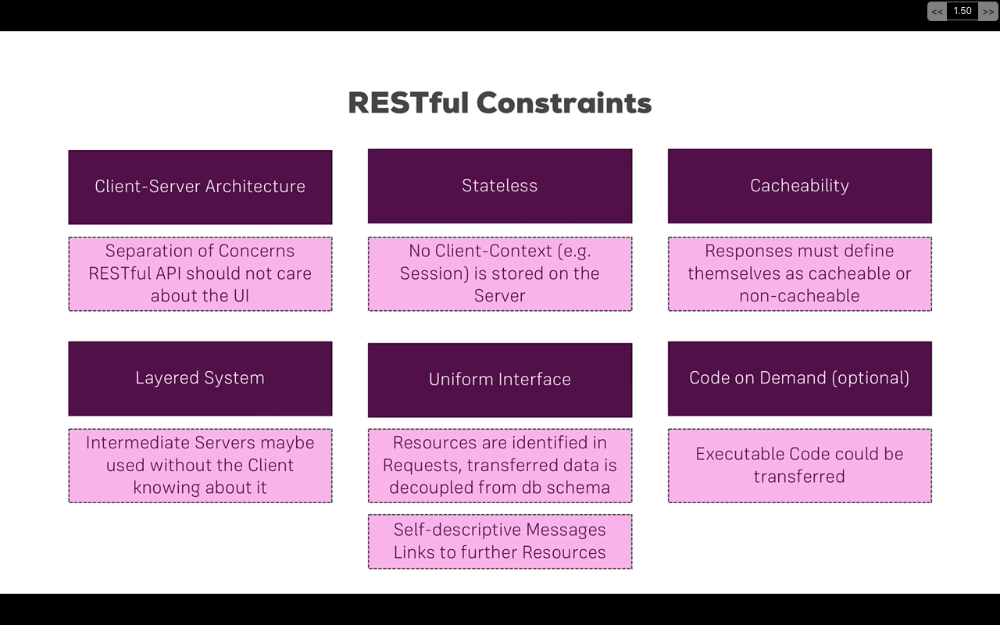

# RESTful API

## Video 1

REpresentational State Transfer


## Video 2

Outline

Red are protected routes

- Starts the development of server and app

## Video 3: Routes

- Adds planned routes for products and orders

## Video 4: Error Handling and improvements

- Adds nodemon, morgan
- adds error handling

## Video 5: CORS and Body Parser

For parsing body I opted for destructuring the request instead

```
const { name, price } = req.body;
const product = {
    name,
    price,
};
```

Also, instead of using body-parser I used Express since now is included

**C**ross - **O**rigin **R**esource **S**haring
For CORS I preferred installing npm cors

##Video 6: MongoDB and Mongoose
I preferred to use async/await with try and catch blocks for mongoose methods
I used findOneAndUpdate() method instead in products

##Video 7: Mongoose validation

- Added validation to both models and routes
- Added Postman Collection with tests for all 9 routes

##Video 8: Managing orders with Mongoose

- Completed orders route and model
